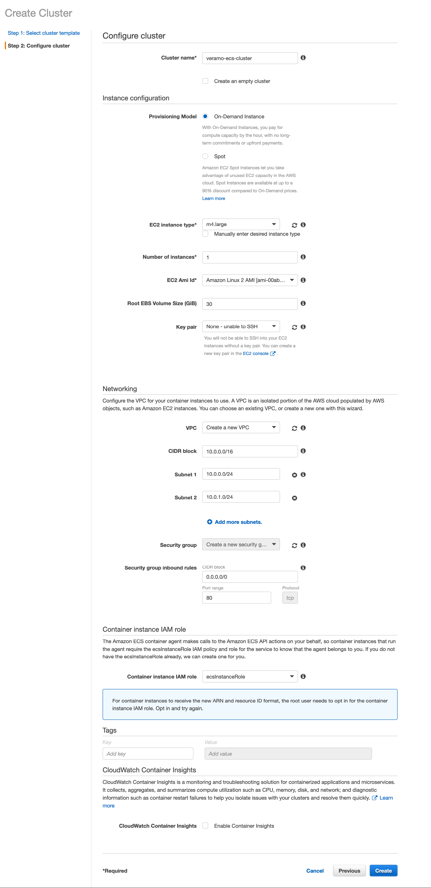
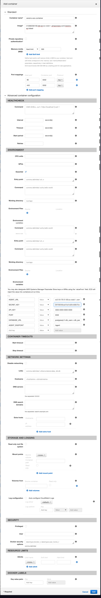
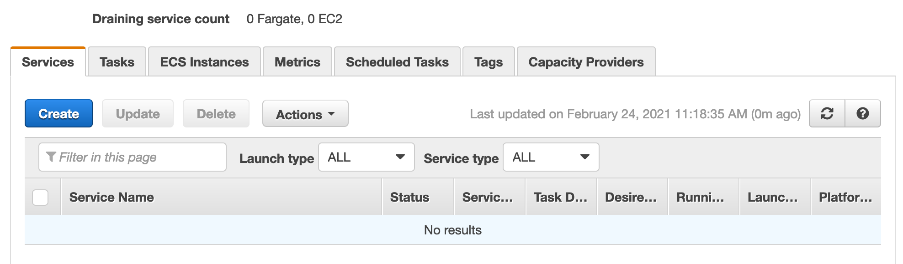
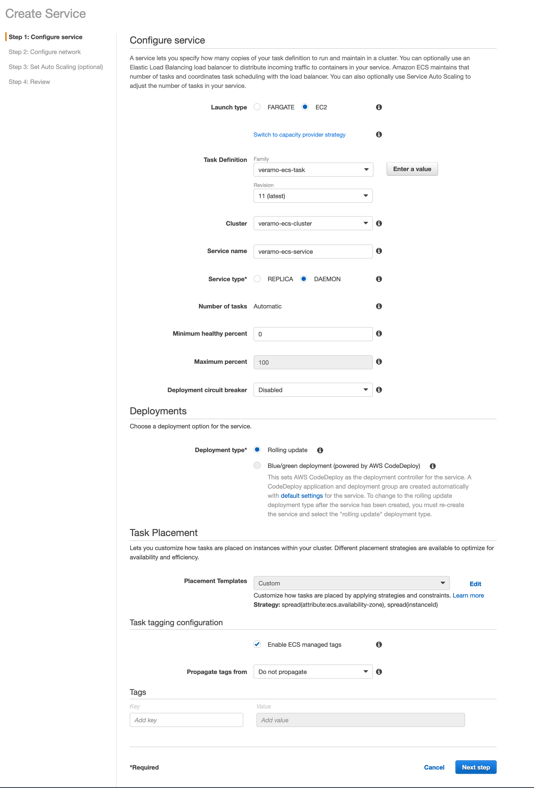

This guide covers the deployment of a [Veramo Cloud Agent](https://github.com/uport-project/veramo-agent-deploy) to AWS using Elastic Container Registry (ECR), Elastic Container Service (ECS), and Relational Database Service (RDS). We will also show how to use a GitHub action to automate building an image, pushing to your container repository, and deploying to the ECS cluster. This setup can be done either through the AWS Console UI or through the CLI

### Prerequisites

1. AWS Account
2. AWS CLI Installed and configured with appropriate permissions (link)

### Clone the [repo](https://github.com/uport-project/veramo-agent-deploy)

```bash
git clone git@github.com:uport-project/veramo-agent-deploy.git veramo-ecs
```

### Create ECR Repository

This can be done either through the [console](https://console.aws.amazon.com/ecr/repositories) or the AWS CLI:

```bash
aws ecr create-repository --repository-name veramo-ecr
```

Which should output something like this:

```
{
    "repository": {
        "repositoryArn": "arn:aws:ecr:<region>:############:repository/veramo-ecr",
        "registryId": "############",
        "repositoryName": "veramo-ecr",
        "repositoryUri": "############.dkr.ecr.<region>.amazonaws.com/veramo-ecr",
        "createdAt": "2021-02-18T10:57:32+02:00",
        "imageTagMutability": "MUTABLE",
        "imageScanningConfiguration": {
            "scanOnPush": false
        },
        "encryptionConfiguration": {
            "encryptionType": "AES256"
        }
    }
}
```

### Push the image to ECR

The following steps can also be found in the AWS Console under "View Push Commands", and those will already have the correct region and URL values for your registry. The commands below will need to be updated with your own values.

- Retrieve an authentication token and authenticate your Docker client to your registry.

```bash
aws ecr get-login-password --region <region> | docker login --username AWS --password-stdin ############.dkr.ecr.<region>.amazonaws.com
```

- Build your Docker image

```bash
docker build -t veramo-ecr .
```

- After the build completes, tag your image:

```bash
docker tag veramo-ecr:latest ############.dkr.ecr.<region>.amazonaws.com.amazonaws.com/veramo-ecr:latest
```

- Run the following command to push this image to your newly created AWS repository:

```bash
docker push ############.dkr.ecr.<region>.amazonaws.com/veramo-ecr:latest
```

### Create the database

Next, go to the [RDS console](https://console.aws.amazon.com/rds/home?region=us-east-1#) for your region to create the Postgres database that we'll be connecting to.

- Choose Postgres for the Database type
- Take note of the user/pass combo you enter - we'll need that later on.
- After creating the databse, also take note of the generated URL.

### Create ECS Cluster

- Go to the [ECS console](https://console.aws.amazon.com/ecs) and choose your region
- Go to clusters and click "Create Cluster"
- Choose EC2 Linux + Networking then click "Next"
- In the next screen, "Configure Cluster":
  - Give your cluster a name
  - Choose an instance type appropriate to your needs. Here, I'm going with m4.large
  - Its useful to add a keypair for accessing the instance directly for debugging purposes.
  - For the remaining fields, the defaults should be fine for most cases.
  - Note: You may want to add a keypair so you'll be able to SSH into the instance for debugging purposes.

Once that is done, click "View Cluster". We'll need to get the public URL for our next step.



- Click view cluster
- Go to the ECS Instances Tab
- Click the container instance and copy public DNS value.

### Create ECS Task

- In the ECS Console, choose Task Definitions from the left menu and click "Create".
- Choose EC2 Launch Type

- Add container
  

c. Pay special attention to the environment variables section. This is where important details are passed to the container. Also note that if the DB username or password contain special characters, they will need to be URL encoded.

### Create ECS Service

With the cluster defined, and the task definition configured, the last step is to add a service to run the task.

- Go to the cluster and click Create under the Services tab:
  
- In the next screen, give your service a name, and for simplicity, choose Daemon for the service type which will make it easier to update the service with a GitHub Action.



Note: Adding a load balancer is optional, but not necessary. The aim for this guide was to keep things fairly simple, but you can add a load balancer here if that fits your project's requirements.

Once the service is running, go to the URL for your instance and you should see the default Veramo page containing links to the DID doc, API Docs, and API Schema. Congrats! You're up and running.

One advantage of using ECS is that is quite straightforward to trigger an update using a Github Action and following [these steps](https://docs.github.com/en/actions/guides/deploying-to-amazon-elastic-container-service), beginning with 3: Store your Amazon ECS task definition as a JSON file in your GitHub repository.
