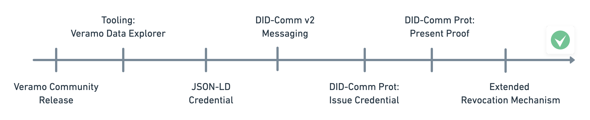

With its initial release Veramo supports an SSI Stack which closely resembles the previous uPort Identity technology
stack. However, since one of the primary design goals of the framework is modularity, the project plans to add
support for various SSI technology elements that can be configured dynamically.

# Feature Roadmap

