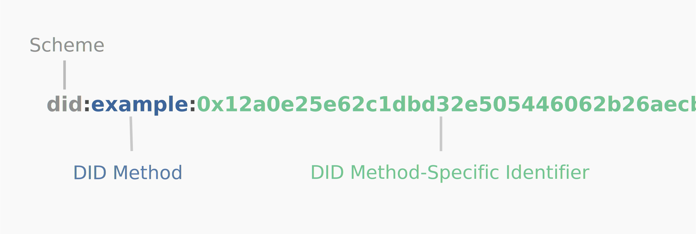

A definition of how a specific DID method scheme is implemented. A DID method is defined by a DID method specification,
which specifies the precise operations by which DIDs and DID documents are created, resolved, updated, and deactivated.
See [DID Methods W3C Spec](https://www.w3.org/TR/did-core/#methods).



## Core Supported DID Methods

The following did methods are supported by Veramo core plugins. If you need to support a specific did method you can
create a plugin for it by forking one these existing ones.

### `did:ethr`

```bash
did:ethr:0xc530503a148babcaca68565cfa576d6f43427a2d
```

[did:ethr Spec](https://github.com/decentralized-identity/ethr-did-resolver/blob/master/doc/did-method-spec.md)
• [Veramo did:ethr provider API](/docs/api/did-provider-ethr.md)

Ethr-DID provides a scalable identity method for Ethereum addresses that gives any Ethereum address the ability to
collect on-chain and off-chain data. Because Ethr-DID allows any Ethereum key pair to become an identity, it is more
scalable and privacy-preserving than smart contract based identity methods.

This particular DID method relies on the ethr-did-registry.
The [ethr-did-registry](https://github.com/uport-project/ethr-did-registry) is a smart contract that facilitates public
key resolution for off-chain (and on-chain) authentication. It also facilitates key rotation, delegate assignment and
revocation to allow 3rd party signers, as well as setting and revoking off-chain attribute data. These interactions and
events are used in aggregate to build the DID document using
the [ethr-did-resolver](https://github.com/decentralized-identity/ethr-did-resolver).

### `did:web`

```bash
did:web:veramo-agent.herokuapp.com
```

[did:web Spec](https://w3c-ccg.github.io/did-method-web/) • [Veramo did:web provider API](/docs/api/did-provider-web.md)

Web-DID leverages the domain name system that allows the owner of a web origin to turn it into a DID. Creating a Web-DID
is as easy as creating a DID Document and hosting it under a well-known URL. The DID Document must be available through
HTTPS GET every time the DID is resolved. This means to create a DID, no Blockchain is required but it comes with
certain tradeoffs. The security of a Web-DID is rooted in the existing Internet PKI by enforcing TLS. A Web-DID can be
hosted either directly under the well-known URL of a web domain, e.g., www.example.com/.well-known/did.json, or under a
specific sub-path. Using sub-paths allows hosting multiple DIDs under one web domain. This approach can also be used to
allow a web application to create Web-DIDs for their users, e.g., www.example.com/users/username/.well-known/did.json.

While Web-DID is a very useful technology to bridge Web2 to Web3 and specifically allow companies very easily to create
their DID, it is has some drawbacks related to security and privacy (e.g., tracking).

### `did:key`

```bash
did:key:z6MkpTHR8VNsBxYAAWHut2Geadd9jSwuBV8xRoAnwWsdvktH
```

[did:key Spec](https://w3c-ccg.github.io/did-method-key/) • [Veramo did:key provider API](/docs/api/did-provider-key.md)

Key-DID represents a very light-weight self-certifying DID method which does not require any external utility such as a
Blockchain. A Key-DID is created by generating a cryptographic key pair (e.g., Curve25519). Using Curve25519 will add
two entries automatically to the DID Document that can be used for EdDSA (i.e., Ed25519) and ECDH/encryption (i.e.,
using X25519). A Key-DID resolves always to the same DID Document and since it is immutable adding service endpoints and
other keys is not possible.
