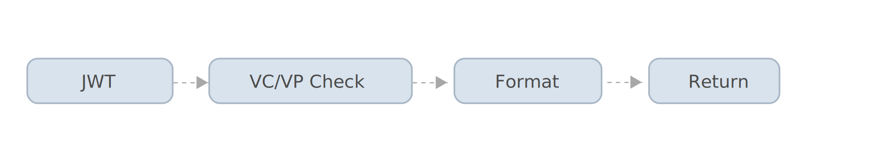

Message handlers implement the AbstractMessageHandler interface and are instatiated as a chain by the Message Handler plugin. Veramo includes a number of message handlers for you to use in your apps.

## Core Supported Message Handlers

The following plugins export a message handling method.

### `did-comm`

[did-jwt](/docs/api/did-comm) • [DIDCommMessageHandler](/docs/api/did-comm.didcommmessagehandler)

DIDCommMessageHandler decrypts incoming messages using the private key of the recipient. The decrypted jwt is passed along to the JWT Message Handler.

### `did-jwt`

[did-jwt](/docs/api/did-jwt) • [JWTMessageHandler](/docs/api/did-jwt.jwtmessagehandler)

JWTMessageHandler takes a JWT and creates a message object.

### `credential-w3c`

[credential-w3c](/docs/api/credential-w3c) • [W3CMessageHandler](/docs/api/credential-w3c.w3cmessagehandler)

W3CMessageHandler checks the message payload for Verifiable Credentials and Verifiable Presentations and formats the message object accordingly.

### `selective-disclosure`

[selective-disclosure](/docs/api/selective-disclosure) • [SDRMessageHandler](/docs/api/selective-disclosure.sdrmessagehandler)

SDRMessageHandler checks the message payload for Selective Disclosure Request formats the message object accordingly. Learm more about selective disclosure requests in the next section.

