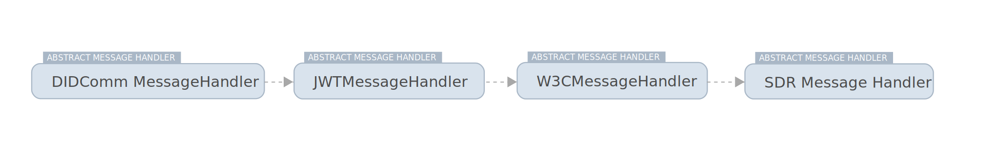

Veramo can communicate with other systems using it's messaging system. The messaging system is comprised of a Message
Type, a MessageHandler interface, a MessageHandler plugin that accepts multiple message parsers plugins that implement
AbstractMessageHandler You can create custom message handling plugins to add new message types for your agent.


### Handling Messages

A message can be introduced to the Agent in a number of ways including via REST endpoint if you are using Veramo Server
or by scanning a QR code if you are using Veramo Client on mobile. The MessageHandler's main responsibility is to try to
convert incoming messages to the correct data model so they can be understood by Veramo and optionally be stored for
later use.

When you bootstrap a Veramo Agent you will have something that looks like this:

```tsx
const agent = new Agent({
  plugins: [
    new MessageHandler({
      messageHandlers: [
        new DIDCommMessageHandler(),
        new JwtMessageHandler(),
        new W3cMessageHandler(),
        new SdrMessageHandler(),
      ],
    }),
  ],
})
```

The MessageHandler handler plugin is instantiated with message parsers. These parsers implement the
AbstractMessageHandler interface. The MessageHandler plugin adds a `handleMessage` method to the agent and can be
invoked by calling `agent.handleMessage()`. Regardless of what configuration your agent is in this method is the
entry-point for all messages.

When the MessageHandler is instantiated it creates a chain of message parsers (AbstractMessageHandler) in the exact
order specified in the configuration.

The above example would look like this:



Each parser will try to read the message and return a message object by examining the payload/type and deciding if it
can do the job or if it should pass it onto the next parser in the chain if one exists. Once a message can be
interpreted a message object is constructed, it is returned and optionally saved.

You can learn more about how each message handler parses messages in the next section.
