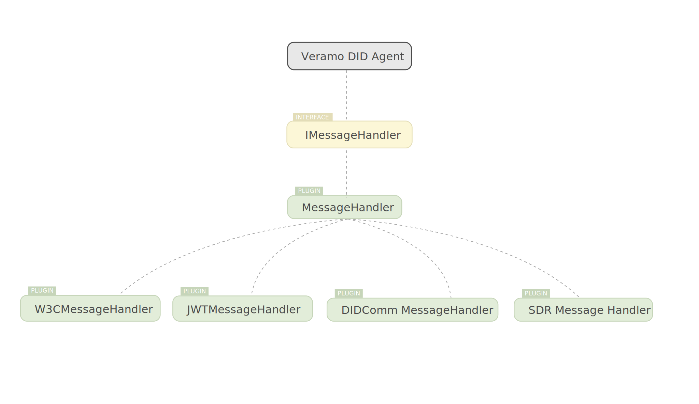

Veramo can communicate with other systems using it's messaging system. The messaging system is comprised of a Message Type, a MessageHandler interface, a MessageHandler plugin that accepts multiple message handling plugins for specific message types. You can create custom message handling plugins to add new message types for your agent.

### Message Format

### Handling Messages

When a message is handled by calling `agent.handleMessage()`
