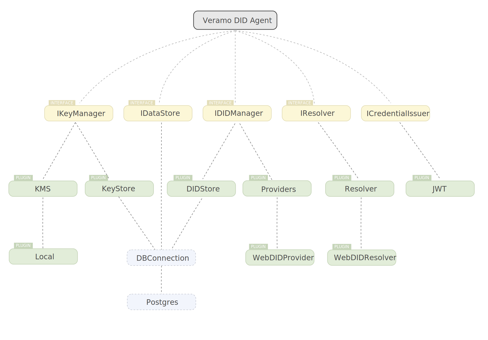

Functionality in Veramo is added to the agent via the plugin system. Writing and configuring plugins is where almost all of the custom work will happen when building applications on Veramo. Your custom plugins can just live in a directory, private repository or on npm where they can be shared with others. We encourage developers to follow some best practices when writing plugins to ensure we have an ecosystem of highly interoperable functions.

## Plugins Architecture

This diagram shows the high level relationship between the core agent, interfaces, plugins and external protocols. This is one simple configuration of many.

## Core Plugins

### `@veramo/did-manager`

[API Reference](/docs/api/did-manager)

### `@veramo/did-provider-ethr`

[API Reference](/docs/api/did-provider-ethr)

### `@veramo/did-provider-web`

[API Reference](/docs/api/did-provider-web)

### `@veramo/key-manager`

[API Reference](/docs/api/key-manager)

### `@veramo/kms-local`

[API Reference](/docs/api/kms-local)

### `@veramo/did-resolver`

[API Reference](/docs/api/did-resolver)

### `@veramo/did-comm`

[API Reference](/docs/api/did-comm)

This plugin provides a method of creating an encrypted message according to the initial DIDComm-js implementation. See the [API Reference](/docs/api/did-comm) for more info.

### `@veramo/did-jwt`

[API Reference](/docs/api/did-jwt)

### `@veramo/message-handler`

[API Reference](/docs/api/message-handler)

### `@veramo/url-handler`

[API Reference](/docs/api/url-handler)

### `@veramo/selective-disclosure`

[API Reference](/docs/api/selective-disclosure)

### `@veramo/credential-w3c`

[API Reference](/docs/api/credential-w3c)

### `@veramo/remote-server`

[API Reference](/docs/api/remote-server)

### `@veramo/data-store`

[API Reference](/docs/api/data-store)

### `@veramo/remote-client`

[API Reference](/docs/api/remote-client)
