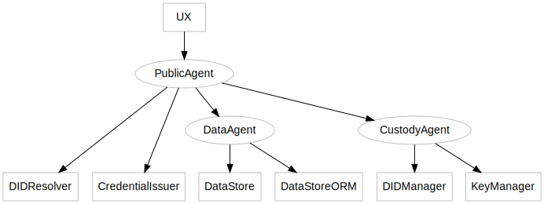

This guide will show how to host multiple agents that expose limited functionality and how to combine them into one agent used by the UI

- custody.example.com agent for kms (identifier and key management)
- data.example.com agent for verifiable data storage
- public.example.com agent for frontend using the other two agents

## Diagram



## Configs

### custody.example.com agent config

```yaml=
version: 2.0

constants:
  baseUrl: https://custody.example.com
  port: 443
  # please use your own X25519 key, this is only an example
  secretKey: 29739248cad1bd1a0fc4d9b75cd4d2990de535baf5caadfdf8d8f86664aa830c
  apiKey: secretApiKey123
  databaseFile: ./database.sqlite
  methods:
    - keyManagerGetKeyManagementSystems
    - keyManagerCreate
    - keyManagerGet
    - keyManagerDelete
    - keyManagerImport
    - keyManagerEncryptJWE
    - keyManagerDecryptJWE
    - keyManagerSign
    - keyManagerSharedSecret
    - keyManagerSignJWT
    - keyManagerSignEthTX
    - didManagerGetProviders
    - didManagerFind
    - didManagerGet
    - didManagerCreate
    - didManagerGetOrCreate
    - didManagerImport
    - didManagerDelete
    - didManagerAddKey
    - didManagerRemoveKey
    - didManagerAddService
    - didManagerRemoveService

# Database
dbConnection:
  $require: typeorm?t=function#createConnection
  $args:
    - type: sqlite
      database:
        $ref: /constants/databaseFile
      synchronize: true
      logging: false
      entities:
        $require: '@veramo/data-store?t=object#Entities'

# Server configuration
server:
  baseUrl:
    $ref: /constants/baseUrl
  port:
    $ref: /constants/port
  use:
    # Add agent to the request object
    - - $require: '@veramo/remote-server?t=function#RequestWithAgentRouter'
        $args:
          - agent:
              $ref: /agent

    # API base path
    - - /agent
      - $require: '@veramo/remote-server?t=function#apiKeyAuth'
        $args:
          - apiKey:
            $ref: /constants/apiKey
      - $require: '@veramo/remote-server?t=function#AgentRouter'
        $args:
          - exposedMethods:
              $ref: /constants/methods

# Key Manager
keyManager:
  $require: '@veramo/key-manager#KeyManager'
  $args:
    - store:
        $require: '@veramo/data-store#KeyStore'
        $args:
          - $ref: /dbConnection
          - $require: '@veramo/kms-local#SecretBox'
            $args:
              - $ref: /constants/secretKey
      kms:
        local:
          $require: '@veramo/kms-local#KeyManagementSystem'

# DID Manager
didManager:
  $require: '@veramo/did-manager#DIDManager'
  $args:
    - store:
        $require: '@veramo/data-store#DIDStore'
        $args:
          - $ref: /dbConnection
      defaultProvider: did:ethr:rinkeby
      providers:
        did:ethr:
          $require: '@veramo/did-provider-ethr#EthrDIDProvider'
          $args:
            - defaultKms: local
              network: mainnet
              rpcUrl: https://mainnet.infura.io/v3/5ffc47f65c4042ce847ef66a3fa70d4c
              gas: 1000001
              ttl: 31104001
        did:web:
          $require: '@veramo/did-provider-web#WebDIDProvider'
          $args:
            - defaultKms: local
        did:key:
          $require: '@veramo/did-provider-key#KeyDIDProvider'
          $args:
            - defaultKms: local

# Agent
agent:
  $require: '@veramo/core#Agent'
  $args:
    - schemaValidation: false
      plugins:
        - $ref: /keyManager
        - $ref: /didManager
```

### data.example.com agent config

```yaml=
version: 2.0

constants:
  baseUrl: http://localhost:3332
  port: 3332
  apiKey: secretApiKey456
  databaseFile: ./database.sqlite
  methods:
    - dataStoreGetMessage
    - dataStoreSaveMessage
    - dataStoreGetVerifiableCredential
    - dataStoreSaveVerifiableCredential
    - dataStoreGetVerifiablePresentation
    - dataStoreSaveVerifiablePresentation
    - dataStoreORMGetIdentifiers
    - dataStoreORMGetIdentifiersCount
    - dataStoreORMGetMessages
    - dataStoreORMGetMessagesCount
    - dataStoreORMGetVerifiableCredentialsByClaims
    - dataStoreORMGetVerifiableCredentialsByClaimsCount
    - dataStoreORMGetVerifiableCredentials
    - dataStoreORMGetVerifiableCredentialsCount
    - dataStoreORMGetVerifiablePresentations
    - dataStoreORMGetVerifiablePresentationsCount

# Data base
dbConnection:
  $require: typeorm?t=function#createConnection
  $args:
    - type: sqlite
      database:
        $ref: /constants/databaseFile
      synchronize: true
      logging: false
      entities:
        $require: '@veramo/data-store?t=object#Entities'

# Server configuration
server:
  baseUrl:
    $ref: /constants/baseUrl
  port:
    $ref: /constants/port
  use:
    # Add agent to the request object
    - - $require: '@veramo/remote-server?t=function#RequestWithAgentRouter'
        $args:
          - agent:
              $ref: /agent

    # API base path
    - - /agent
      - $require: '@veramo/remote-server?t=function#apiKeyAuth'
        $args:
          - apiKey:
            $ref: /constants/apiKey
      - $require: '@veramo/remote-server?t=function#AgentRouter'
        $args:
          - exposedMethods:
              $ref: /constants/methods

# Agent
agent:
  $require: '@veramo/core#Agent'
  $args:
    - schemaValidation: false
      plugins:
        - $require: '@veramo/data-store#DataStore'
          $args:
            - $ref: /dbConnection
        - $require: '@veramo/data-store#DataStoreORM'
          $args:
            - $ref: /dbConnection
```

### public.example.com agent setup

```yaml=
version: 2.0

constants:
  baseUrl: https://public.example.com
  port: 443
  methods:
    - keyManagerGetKeyManagementSystems
    - keyManagerCreate
    - keyManagerGet
    - keyManagerDelete
    - keyManagerImport
    - keyManagerEncryptJWE
    - keyManagerDecryptJWE
    - keyManagerSign
    - keyManagerSharedSecret
    - keyManagerSignJWT
    - keyManagerSignEthTX
    - didManagerGetProviders
    - didManagerFind
    - didManagerGet
    - didManagerCreate
    - didManagerGetOrCreate
    - didManagerImport
    - didManagerDelete
    - didManagerAddKey
    - didManagerRemoveKey
    - didManagerAddService
    - didManagerRemoveService
    - resolveDid
    - getDIDComponentById
    - dataStoreGetMessage
    - dataStoreSaveMessage
    - dataStoreGetVerifiableCredential
    - dataStoreSaveVerifiableCredential
    - dataStoreGetVerifiablePresentation
    - dataStoreSaveVerifiablePresentation
    - dataStoreORMGetIdentifiers
    - dataStoreORMGetIdentifiersCount
    - dataStoreORMGetMessages
    - dataStoreORMGetMessagesCount
    - dataStoreORMGetVerifiableCredentialsByClaims
    - dataStoreORMGetVerifiableCredentialsByClaimsCount
    - dataStoreORMGetVerifiableCredentials
    - dataStoreORMGetVerifiableCredentialsCount
    - dataStoreORMGetVerifiablePresentations
    - dataStoreORMGetVerifiablePresentationsCount
    - sendMessageDIDCommAlpha1
    - createVerifiablePresentation
    - createVerifiableCredential

# Server configuration
server:
  baseUrl:
    $ref: /constants/baseUrl
  port:
    $ref: /constants/port
  use:
    # CORS
    - - $require: 'cors'

    # Add agent to the request object
    - - $require: '@veramo/remote-server?t=function#RequestWithAgentRouter'
        $args:
          - agent:
              $ref: /agent

    # DID Documents
    - - $require: '@veramo/remote-server?t=function#WebDidDocRouter'

    # API base path
    - - /agent
      - $require: '@veramo/remote-server?t=function#AgentRouter'
        $args:
          - exposedMethods:
              $ref: /constants/methods

    # Open API schema
    - - /open-api.json
      - $require: '@veramo/remote-server?t=function#ApiSchemaRouter'
        $args:
          - basePath: /agent
            apiName: Public agent
            apiVersion: '1.0.0'
            exposedMethods:
              $ref: /constants/methods

    # Swagger docs
    - - /api-docs
      - $require: swagger-ui-express?t=object#serve
      - $require: swagger-ui-express?t=function#setup
        $args:
          - null
          - swaggerOptions:
              url: '/open-api.json'

# DID resolvers
didResolver:
  $require: '@veramo/did-resolver#DIDResolverPlugin'
  $args:
    - resolver:
        $require: did-resolver#Resolver
        $args:
          - ethr:
              $ref: /ethr-did-resolver
            web:
              $ref: /web-did-resolver
            key:
              $ref: /did-key-resolver
            elem:
              $ref: /universal-resolver
            io:
              $ref: /universal-resolver
            ion:
              $ref: /universal-resolver
            sov:
              $ref: /universal-resolver

ethr-did-resolver:
  $require: ethr-did-resolver?t=function&p=/ethr#getResolver
  $args:
    - networks:
        - name: mainnet
          rpcUrl: https://mainnet.infura.io/v3/5ffc47f65c4042ce847ef66a3fa70d4c
        - name: rinkeby
          rpcUrl: https://rinkeby.infura.io/v3/5ffc47f65c4042ce847ef66a3fa70d4c
        - name: ropsten
          rpcUrl: https://ropsten.infura.io/v3/5ffc47f65c4042ce847ef66a3fa70d4c
        - name: kovan
          rpcUrl: https://kovan.infura.io/v3/5ffc47f65c4042ce847ef66a3fa70d4c
        - name: goerli
          rpcUrl: https://goerli.infura.io/v3/5ffc47f65c4042ce847ef66a3fa70d4c
        - name: private
          rpcUrl: http://localhost:8545/
          registry: '0x05cc574b19a3c11308f761b3d7263bd8608bc532'

web-did-resolver:
  $require: web-did-resolver?t=function&p=/web#getResolver

universal-resolver:
  $require: '@veramo/did-resolver#UniversalResolver'
  $args:
    - url: https://dev.uniresolver.io/1.0/identifiers/

did-key-resolver:
  $require: '@veramo/did-provider-key?t=function&p=/key#getDidKeyResolver'

# KeyManager + DIDManager
custodyAgent:
  $require: '@veramo/remote-client#AgentRestClient'
  $args:
    - url: https://custody.example.com/agent
      headers:
        Authorization: Bearer secretApiKey123
      enabledMethods:
        - keyManagerGetKeyManagementSystems
        - keyManagerCreate
        - keyManagerGet
        - keyManagerDelete
        - keyManagerImport
        - keyManagerEncryptJWE
        - keyManagerDecryptJWE
        - keyManagerSign
        - keyManagerSharedSecret
        - keyManagerSignJWT
        - keyManagerSignEthTX
        - didManagerGetProviders
        - didManagerFind
        - didManagerGet
        - didManagerCreate
        - didManagerGetOrCreate
        - didManagerImport
        - didManagerDelete
        - didManagerAddKey
        - didManagerRemoveKey
        - didManagerAddService
        - didManagerRemoveService

# DataStore
dataAgent:
  $require: '@veramo/remote-client#AgentRestClient'
  $args:
    - url: https://data.example.com/agent
      headers:
        Authorization: Bearer secretApiKey456
      enabledMethods:
        - dataStoreGetMessage
        - dataStoreSaveMessage
        - dataStoreGetVerifiableCredential
        - dataStoreSaveVerifiableCredential
        - dataStoreGetVerifiablePresentation
        - dataStoreSaveVerifiablePresentation
        - dataStoreORMGetIdentifiers
        - dataStoreORMGetIdentifiersCount
        - dataStoreORMGetMessages
        - dataStoreORMGetMessagesCount
        - dataStoreORMGetVerifiableCredentialsByClaims
        - dataStoreORMGetVerifiableCredentialsByClaimsCount
        - dataStoreORMGetVerifiableCredentials
        - dataStoreORMGetVerifiableCredentialsCount
        - dataStoreORMGetVerifiablePresentations
        - dataStoreORMGetVerifiablePresentationsCount

# Agent
agent:
  $require: '@veramo/core#Agent'
  $args:
    - schemaValidation: false
      plugins:
        - $ref: /dataAgent
        - $ref: /custodyAgent
        - $ref: /didResolver
        - $require: '@veramo/credential-w3c#CredentialIssuer'
```
